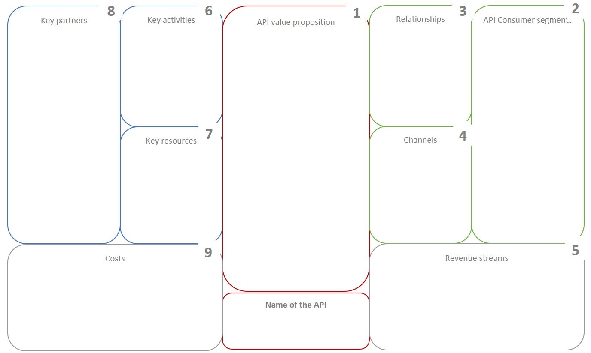

API Canvas is a tool to Visualize, Design and Test how to create value for customers. It directs user to understand the full API life-cycle and to think how to communicate and support the API consumers and give them access to the API. It also focuses on how to monetize the API and add value; like customer retention or cost savings. Main benefit of API Canvas compared to for example project scoping tools is that it **treats the API as a product**. This means that it tries to find the needs of several API Consumer segments, not just the one at hand. API Canvas was adapted from Alex Osterwalder's Business Model Canvas and optimized for the API Development.

APIOps&reg; Cycles design book starts withe visual chart templates for discovering key business and technical value, tasks and resources.
- **API Value Proposition Canvas**
- **API Canvas**

## API Value Proposition Canvas (AVP)

The **Value Proposition Canvas** is composed to two parts, the **API Consumer View** and **API Provider View**.

With the **API Consumer View** you describe the tasks the consumer needs to achieve. Describe step by step tasks API consumer needs to achieve. Highlight your consumer **pains** which prevents or makes it difficult to get the task done. You can describe pains, risks and negative outcomes consumer want to avoid or dissatisfaction of existing solutions. Outline customer **gains** which describe how customers measure the success for job well done. In Gains section, describe concrete results, benefits, positive outcome and even aspirations which customer hopes to achieve. 

With the **API Provider View**, you list the **API products or services** your value proposition builds on. Describe in which way these products, services and features are **pain relievers**, how they eliminate, reduce or minimize pains consumers care about. Outline in which way they are **gain creators**. How they produce, increase or maximize outcomes and benefits that your consumer expects.

The value proposition makes explicit how the API's relieve pains and create gains. Use it to design, test and iterate your value proposition until you figure out what resonates to consumers. You achieve **fit** by creating a clear connection between what matters to customers and how your products, services and features ease pain and create gains.

## API Canvas

The **API Canvas** is composed of nine areas, which have almost the same titles as in Business Model Canvas. Canvas is composed to four parts, **Value Proposition**, **Infrastructure**, **Consumers** and **Finances**.

With the **Value Proposition** you describe the features  and services to meet the needs of the API Consumers. The value proposition provides value through various elements such as newness, performance, customization, "getting the job done", design, brand/status, price, cost reduction, risk reduction, accessibility and convenience and usability. 

With the **Infrastructure** related part you describe **Key Activities** in executing the value proposition, **Key Resources** that are necessary to create value for the API consumer and **Key Partners**, people or resources needed to realize API-features in practice.

With the **Consumers** part you describe which **API Consumer Segment** the Value Proposition tries to serve. Various set of consumers can be segmented based on the different needs and attributes to ensure appropriate usage and implementation of the API. In **Relationships** section identify the type of relationship you want to create with consumers, how to ensure API is usable from consumers perspective. In **Channels** section describe how the API is delivered to its targeted consumers, end-users and developers. Efficient channels will distribute the the value proposition in ways that are fast, efficient and cost effective.

With the **Finances** part you describe the financial aspects of the value proposition. In **Cost Structure** section describe most important monetary consequences related to operating the API, In **Revenue Streams** section describe ways the company makes income from each customer segment.

**API Canvas** is the **master document** for next phases, including architecture design. The simpler API Value Proposition Canvas helps to create value proposition and related information to the API Canvas.You should share the API Canvas with all relevant stakeholders. This includes external developers and other partners you need to work with.

Start with the API Value Proposition Canvas. **It’s a great interviewing tool**. Use it when finding and validating requirements with API Consumers.

Use [API Canvas Instructions](apicanvasinstructions) to fill in the details in API Canvas and in API Value Proposition.
