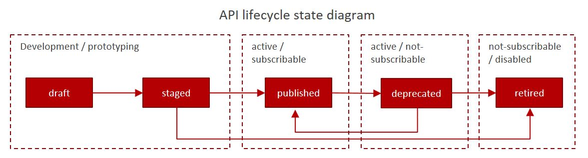

As APi's are considered to be **products** they also have a lifecycle. Having a formal lifecycle helps you to understand the implications of changes in API's and gives your API consumers assurance and confidence to use the API's. API's are published to Catalogs or API Store's using API Management Products to make them available for API consumers.

API Lifecycle has a **series of states**, which might depend on the API Management Product used. When you manage your API's, you move them through the lifecycle states. From initially staging the API version to a Catalog, through to publishing to make the API available to you developers, and to eventually retiring and archiving.

Approval might be required to move API through lifecycle states, in most cases approval is required when moving the API to subscribable state or from subscribable state to non-subscribable state or retired state. States can be automated and connected to CI pipelines

## States

Here's an example of states API can have

### Draft

The draft state for an API is when the API definition is not deployed and is not associated with any Catalog. 

### Staged

When you stage an API, a copy of the API version is deployed to the target Catalog. Staged is the initial state when you publish the API. When an API is in the staged state, **it is not yet visible to, or subscribable by any developers**. Staging state is sometimes referred as **Prototyping** State

### Published

When you publish an API, a fixed copy of the API version is deployed to the target Catalog. **The API version is visible to and subscribable by the targeted developers or communities.** When an API is published in a Catalog, the visibility and subscription settings can be changed for the published version of that API. **Any further changes require a new version** of the API to be staged and published before they take effect. In certain cases, Publish state needs to be in-sync with backend release cycles. 

### Deprecated

When you deprecate an API, the API version is visible only to developers whose applications are currently subscribed. **No new subscriptions to the API is possible**. When a new version of API is Published, earlier version should be Deprecated. Some API Management Products has a feature that automatically deprecates an earlier version.

### Retired / Archived

When you retire an API, the API version can neither be viewed nor it can be subscribed. API is taken offline, even for the earlier subscribers, and **no-one can invoke it any more**.

 
