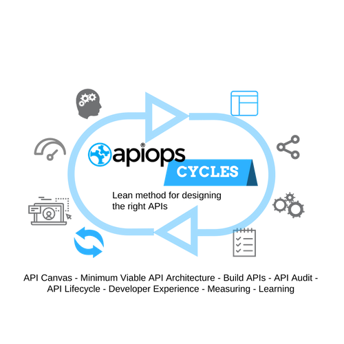

The APIOps&reg; Cycles is a set of tools and methods for designing **API Management compatible API's with Clear business orientation and best practice architecture patters**.

APIOps&reg; method uses modern and proven frameworks with a twist of our experience to the them for APIs. All methods have a Lean management base: [DevOps (wikipedia)](https://en.wikipedia.org/wiki/DevOps), [Business Model Canvas (wikipedia)](https://en.wikipedia.org/wiki/Business_Model_Canvas), [Value Proposition Canvas](), [Lean Startup (wikipedia)](https://en.wikipedia.org/wiki/Lean_startup), [Minimum Viable Architecture](https://www.enterpriseirregulars.com/116163/minimum-viable-architecture-good-enough-good-enough-enterprise/) and [API Model Canvas](https://www.slideshare.net/3scale/api-model-canvas-apidays-mediterranea-2015). Afore mentioned frameworks, tools and methods have been re-interpreted to create the APIOps&reg; Cycles. 

APIOps&reg; Cycles is created in collaboration with open non-profit [APIOps.net Community](https://medium.com/apiops) and [Digia Plc](www.digia.com). APIOps&reg; is a registered trademark of [APInf Oy](http://apinf.com). Templates and method is licensed under a [Creative Commons Attribution-ShareAlike 4.0 International License (CC BY-SA 4.0)](https://creativecommons.org/licenses/by-sa/4.0/)

[**APIOPs&reg; community**](http://apiops.net) is open for all and used as framework to promote and develop APIOps&reg; Cycles.  

**RESTful API**'s are in the core of services. One major difference to normal API development is that APIs are considered as products, not unique services. APIs are owned, improved continuosly and should be advocated for the consumers. They can be sold and bought and they are the lifeblood to the applications using them.

The APIs should provide not only value to your consumers but should be appealing to developers. They should be easy to understand, discover and use, a set of API's should always be consistent. API's can be used by several consumers; applications or even devices.

**[Zalando RestAPI design Principles: "RESTful API as a Product makes the difference between enterprise integration business and agile, innovative product service business built on a platform of APIs."](http://zalando.github.io/restful-api-guidelines/design-principles/DesignPrinciples.html)**

All methods used are **technology agnostic**. Used technology to create, manage, release and test the APIs should be evaluated per purpose. Open source technologies as well as commercial products are possible to use with APIOps&reg; Cycles.

**APIOps&reg; goal is to design, build, test and release APIs more rapidly, frequently and reliably. In short, to build standardized API value chain automation**

### Digia Plc.
[Digia Plc](www.digia.com) is using APIOps&reg; Cycles in their own customer projects. The purpose of the guidelines is to define standards in API Driven development and to continuosly develop the methods and best practices.

### APInf Oy
[APInf Oy](apinf.com) contributes to APIOps&reg; Cycles and promotes it to all customers. Although APIOps&reg; trademark is registered trademark of APInf Oy, [it stays with community, contributors and members are encouraged to address it](https://medium.com/apinf/apinf-with-apiops-799dc5102e41). APIOps&reg; trademark brings an unique identity to the community. APInf Oy commits to stay as active contributor and partner of APIOps&reg;.
